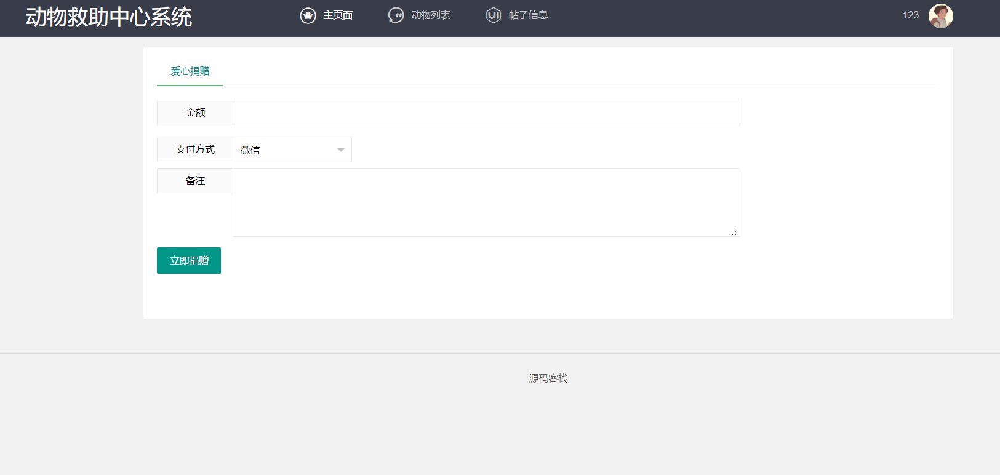
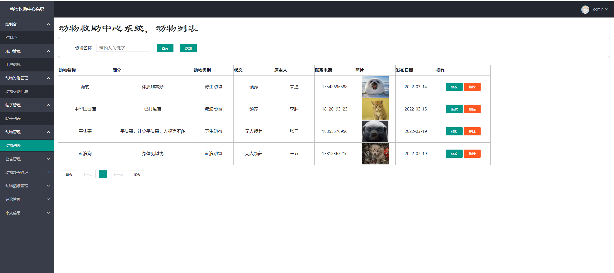
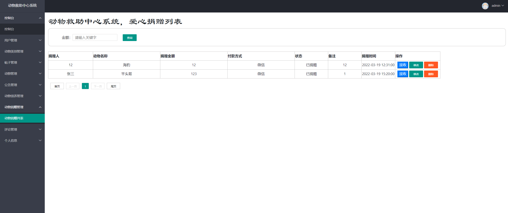
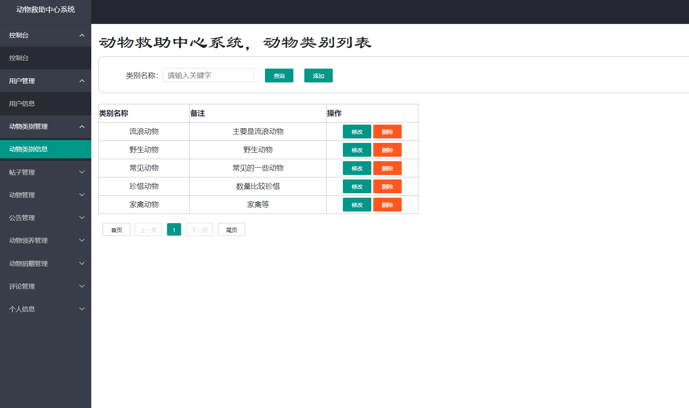
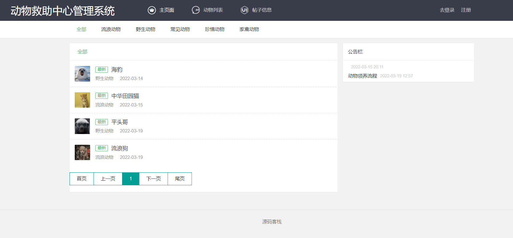

基于Springboot的动物救助中心系统
=
### 完整代码获取地址：从戎源码网 ([https://armycodes.com/](https://armycodes.com/))
### 作者微信：19941326836  QQ：952045282 
### 承接计算机毕业设计、Java毕业设计、Python毕业设计、深度学习、机器学习
### 选题+开题报告+任务书+程序定制+安装调试+论文+答辩ppt 一条龙服务
### 所有选题地址https://github.com/nature924/allProject

一、项目介绍
---
基于SpringBoot框架的实现的动物救助中心系统，本系统共分为2个角色：系统管理员、用户，主要功能如下

### 【管理员】：
1. 登录：管理员可以通过登录系统来管理各种功能。
2. 用户管理：管理员可以查看用户列表，包括用户的个人信息、注册时间等，并可以进行编辑和删除操作。
3. 动物类别管理：管理员可以管理动物的类别，包括添加新的动物类别、编辑类别信息和删除类别等操作。
4. 动物管理：管理员可以管理动物的信息，包括添加新的动物、编辑动物信息和删除动物等操作。
5. 帖子管理：管理员可以管理用户发布的帖子，包括查看帖子列表、删除帖子和置顶帖子等操作。
6. 领养管理：管理员可以管理用户的领养申请，包括查看领养申请列表、审核申请和取消申请等操作。
7. 捐赠管理：管理员可以管理用户的捐赠信息，包括查看捐赠列表、查看捐赠详情和确认捐赠等操作。
8. 评论管理：管理员可以管理用户对帖子的评论，包括查看评论列表、删除评论和回复评论等操作。
9. 公告管理：管理员可以发布系统公告，包括编辑公告内容、设置公告显示时间等操作。
10. 数据统计：管理员可以查看系统的统计数据，包括用户总数、动物总数、捐赠总额等。
11. 个人信息管理：管理员可以管理自己的个人信息，包括编辑个人信息和修改密码等操作。

### 【用户】：
1. 注册：用户可以进行注册操作，填写个人信息并获取账号。
2. 登录：用户可以通过登录系统来使用各项功能。
3. 动物列表：用户可以查看动物的列表，包括动物的种类、简介和图片等信息。
4. 爱心捐赠：用户可以进行爱心捐赠，选择捐赠金额并填写相关信息。
5. 动物领养：用户可以申请领养动物，填写申请表并等待管理员审核。
6. 个人信息：用户可以查看和编辑自己的个人信息，包括头像、昵称、联系方式等。
7. 我的订单：用户可以查看自己的捐赠订单，包括捐赠金额、订单号、捐赠时间等。
8. 我的申请：用户可以查看自己的领养申请，包括申请状态、申请时间等。
9. 评论帖子：用户可以对帖子进行评论，包括发表评论、删除评论和回复评论等操作。

二、项目技术
---
- 编程语言：Java
- 数据库：MySQL
- 项目管理工具：Maven
- 前端技术：VUE、HTML、Jquery、Bootstrap
- 后端技术：Spring、SpringMVC、MyBatis

三、运行环境
---
- 操作系统：Windows、macOS都可以
- JDK版本：JDK1.8以上都可以
- 开发工具：IDEA、Ecplise、Myecplise都可以
- 数据库: MySQL5.7以上都可以
- Tomcat：任意版本都可以
- Maven：任意版本都可以

四、运行截图
---

### 程序截图：

